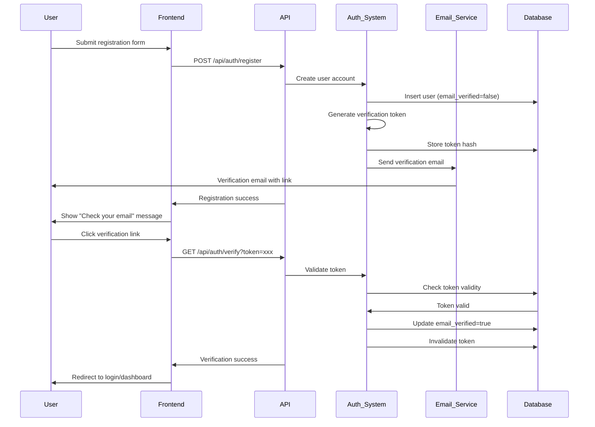
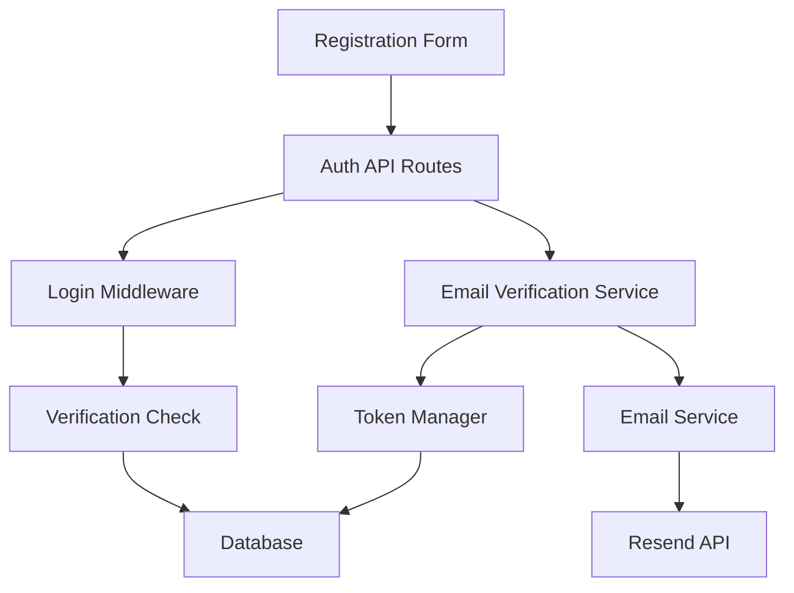

# Design Document: Email Verification

## Overview

This design implements email verification for user registration using Supabase Auth's built-in email verification capabilities, extended with custom token management and integrated with the existing Resend email service. The solution ensures that users must verify their email addresses before gaining access to the platform, enhancing security and data quality.

The implementation leverages:
- Supabase Auth for user management and built-in email verification
- Resend for email delivery with custom templates
- Next.js API routes for verification endpoints
- TypeScript for type safety
- Existing authentication infrastructure

## Architecture

### High-Level Flow



### Component Architecture



## Components and Interfaces

### 1. Email Verification Service

**Location:** `src/lib/auth/email-verification.ts`

**Purpose:** Core service managing email verification logic, token generation, and validation.

**Interface:**
```typescript
interface EmailVerificationService {
  // Create verification token for a user
  createVerificationToken(userId: string, email: string): Promise<VerificationToken>
  
  // Validate and consume a verification token
  verifyToken(token: string): Promise<VerificationResult>
  
  // Resend verification email
  resendVerificationEmail(email: string): Promise<ResendResult>
  
  // Check if user email is verified
  isEmailVerified(userId: string): Promise<boolean>
  
  // Clean up expired tokens
  cleanupExpiredTokens(): Promise<number>
}

interface VerificationToken {
  token: string          // Plain text token (sent in email)
  tokenHash: string      // Hashed token (stored in DB)
  userId: string
  email: string
  expiresAt: Date
}

interface VerificationResult {
  success: boolean
  userId?: string
  email?: string
  error?: 'expired' | 'invalid' | 'already_verified' | 'server_error'
  message?: string
}

interface ResendResult {
  success: boolean
  error?: 'not_found' | 'already_verified' | 'rate_limited' | 'server_error'
  message?: string
  attemptsRemaining?: number
}
```

**Implementation Details:**
- Uses `crypto.randomBytes(32)` for token generation (256 bits of entropy)
- Stores SHA-256 hash of tokens in database
- Uses constant-time comparison for token validation
- Implements rate limiting using database timestamps
- Integrates with existing Supabase user management

### 2. Token Manager

**Location:** `src/lib/auth/verification-tokens.ts`

**Purpose:** Handles cryptographic token operations and database interactions.

**Interface:**
```typescript
interface TokenManager {
  // Generate a secure random token
  generateToken(): string
  
  // Hash a token for storage
  hashToken(token: string): string
  
  // Compare token with hash (constant-time)
  verifyTokenHash(token: string, hash: string): boolean
  
  // Store token in database
  storeToken(userId: string, tokenHash: string, expiresAt: Date): Promise<void>
  
  // Retrieve token data by plain token
  getTokenData(token: string): Promise<TokenData | null>
  
  // Invalidate a token
  invalidateToken(tokenHash: string): Promise<void>
  
  // Delete expired tokens
  deleteExpiredTokens(): Promise<number>
}

interface TokenData {
  id: string
  userId: string
  tokenHash: string
  expiresAt: Date
  createdAt: Date
}
```

**Security Considerations:**
- Tokens are 32 bytes (256 bits) encoded as base64url (43 characters)
- SHA-256 hashing for storage
- Constant-time comparison using `crypto.timingSafeEqual`
- Automatic expiration after 24 hours
- Single-use tokens (invalidated after verification)

### 3. API Routes

**Location:** `src/app/api/auth/`

**Endpoints:**

#### POST /api/auth/register
```typescript
interface RegisterRequest {
  email: string
  password: string
  // ... other registration fields
}

interface RegisterResponse {
  success: boolean
  userId?: string
  message: string
  requiresVerification: boolean
}
```

**Behavior:**
1. Validate input data
2. Create user in Supabase Auth (email_verified=false)
3. Generate verification token
4. Send verification email
5. Return success response

#### GET /api/auth/verify
```typescript
interface VerifyRequest {
  token: string  // Query parameter
}

interface VerifyResponse {
  success: boolean
  message: string
  redirectUrl?: string
}
```

**Behavior:**
1. Extract token from query parameter
2. Validate token
3. Update user email_verified status
4. Invalidate token
5. Return success/error response

#### POST /api/auth/resend-verification
```typescript
interface ResendRequest {
  email: string
}

interface ResendResponse {
  success: boolean
  message: string
  attemptsRemaining?: number
}
```

**Behavior:**
1. Validate email exists
2. Check if already verified
3. Check rate limit (3 per hour)
4. Invalidate old tokens
5. Generate new token
6. Send new verification email

### 4. Login Middleware

**Location:** `src/lib/auth/middleware.ts`

**Purpose:** Intercept login attempts and enforce email verification.

**Interface:**
```typescript
interface LoginMiddleware {
  // Check verification before allowing login
  checkEmailVerification(userId: string): Promise<VerificationCheckResult>
}

interface VerificationCheckResult {
  verified: boolean
  allowLogin: boolean
  message?: string
  resendUrl?: string
}
```

**Integration Point:**
- Extends existing Supabase Auth sign-in flow
- Checks `email_verified` field after successful credential validation
- Returns appropriate error if not verified

### 5. Email Templates

**Location:** `src/lib/auth/email-verification-templates.ts`

**Purpose:** Generate verification email content using existing email template system.

**Interface:**
```typescript
interface VerificationEmailTemplate {
  getVerificationEmail(
    verificationUrl: string,
    userEmail: string
  ): Promise<EmailContent>
}

interface EmailContent {
  subject: string
  htmlContent: string
  textContent: string
}
```

**Template Variables:**
- `{{verification_url}}` - Full verification link
- `{{user_email}}` - User's email address
- `{{company_name}}` - Platform name
- `{{expiration_hours}}` - Token expiration time (24)

**Email Content:**
- Professional HTML template with branding
- Clear call-to-action button
- Plain text fallback link
- Security notice about expiration
- Statement about ignoring if not requested

## Data Models

### Database Schema

#### Users Table (Existing - Extended)
```sql
-- Extend existing Supabase auth.users table metadata
-- email_verified is built into Supabase Auth
-- We'll use Supabase's email_confirmed_at field
```

#### Verification Tokens Table (New)
```sql
CREATE TABLE verification_tokens (
  id UUID PRIMARY KEY DEFAULT gen_random_uuid(),
  user_id UUID NOT NULL REFERENCES auth.users(id) ON DELETE CASCADE,
  token_hash TEXT NOT NULL,
  expires_at TIMESTAMP WITH TIME ZONE NOT NULL,
  created_at TIMESTAMP WITH TIME ZONE DEFAULT NOW(),
  
  -- Indexes for performance
  INDEX idx_verification_tokens_user_id (user_id),
  INDEX idx_verification_tokens_expires_at (expires_at),
  INDEX idx_verification_tokens_token_hash (token_hash)
);

-- Enable Row Level Security
ALTER TABLE verification_tokens ENABLE ROW LEVEL SECURITY;

-- Only service role can access tokens
CREATE POLICY "Service role only" ON verification_tokens
  FOR ALL USING (auth.role() = 'service_role');
```

#### Rate Limiting Table (New)
```sql
CREATE TABLE verification_rate_limits (
  id UUID PRIMARY KEY DEFAULT gen_random_uuid(),
  email TEXT NOT NULL,
  attempt_count INTEGER DEFAULT 1,
  window_start TIMESTAMP WITH TIME ZONE DEFAULT NOW(),
  
  -- Unique constraint on email
  UNIQUE(email)
);

-- Index for cleanup
CREATE INDEX idx_verification_rate_limits_window_start 
  ON verification_rate_limits(window_start);

-- Enable RLS
ALTER TABLE verification_rate_limits ENABLE ROW LEVEL SECURITY;

-- Service role only
CREATE POLICY "Service role only" ON verification_rate_limits
  FOR ALL USING (auth.role() = 'service_role');
```

### TypeScript Types

```typescript
// Extend existing User type
export interface User {
  id: string
  email: string
  email_verified: boolean  // Maps to Supabase email_confirmed_at
  shopifyStoreId: string | null
  role: UserRole
  createdAt: Date
  lastLoginAt: Date | null
}

// Verification token record
export interface VerificationTokenRecord {
  id: string
  userId: string
  tokenHash: string
  expiresAt: Date
  createdAt: Date
}

// Rate limit record
export interface RateLimitRecord {
  id: string
  email: string
  attemptCount: number
  windowStart: Date
}
```

## Correctness Properties

*A property is a characteristic or behavior that should hold true across all valid executions of a system—essentially, a formal statement about what the system should do. Properties serve as the bridge between human-readable specifications and machine-verifiable correctness guarantees.*


### Property 1: Registration Creates Unverified Account with Valid Token
*For any* valid registration data, when a user account is created, the account should have verification status set to false, and a verification token should be generated with exactly 24 hours expiration time, and the token should be at least 32 characters in length.
**Validates: Requirements 1.1, 1.2, 5.2**

### Property 2: Token Storage and Hashing
*For any* generated verification token, the token stored in the database should be a hash of the original token, not the plain text token.
**Validates: Requirements 1.4, 5.3**

### Property 3: Verification Email Contains Required Elements
*For any* verification email generated, the email content should contain the verification link as a URL parameter, the company name, a call-to-action button/link, a plain-text version of the link, a security notice about 24-hour expiration, and a statement about ignoring if not requested.
**Validates: Requirements 1.5, 7.1, 7.3, 7.4, 7.5, 7.6**

### Property 4: Valid Token Verification Succeeds
*For any* valid and non-expired verification token, when verification is attempted, the user's verification status should be set to true, and the token should be invalidated to prevent reuse.
**Validates: Requirements 2.2, 2.6**

### Property 5: Expired Token Verification Fails
*For any* expired verification token, when verification is attempted, the system should return an error indicating token expiration and should not change the user's verification status.
**Validates: Requirements 2.3, 8.1**

### Property 6: Invalid Token Verification Fails
*For any* invalid or non-existent verification token, when verification is attempted, the system should return an error indicating invalid token and should not change any user's verification status.
**Validates: Requirements 2.4, 8.2**

### Property 7: Successful Verification Redirects
*For any* successful verification, the response should include a redirect URL to a success confirmation page.
**Validates: Requirements 2.5**

### Property 8: Unverified Users Cannot Login
*For any* user account with verification status false, when a login attempt is made with valid credentials, the login should be rejected with an error message that includes instructions to verify email and a link to resend verification.
**Validates: Requirements 3.1, 3.2, 3.4, 3.5**

### Property 9: Verified Users Can Login
*For any* user account with verification status true, when a login attempt is made with valid credentials, the verification check should not block the login process.
**Validates: Requirements 3.3, 6.3**

### Property 10: Resend Invalidates Old Tokens and Creates New One
*For any* valid resend verification request for an existing unverified account, all existing verification tokens for that account should be invalidated, and a new token with 24-hour expiration should be generated.
**Validates: Requirements 4.1, 4.2, 4.3**

### Property 11: Rate Limiting Prevents Abuse
*For any* email address, when more than 3 resend verification requests are made within a 1-hour window, the 4th and subsequent requests should be rejected with a rate limit error.
**Validates: Requirements 4.5**

### Property 12: Verification Status Persists
*For any* user account that has verification status set to true, the status should remain true across all subsequent database reads and login sessions.
**Validates: Requirements 6.1, 6.2**

### Property 13: Email Change Resets Verification
*For any* verified user account, when the email address is changed, the verification status should be reset to false and a new verification process should be initiated.
**Validates: Requirements 6.4**

### Property 14: Already Verified Accounts Handle Gracefully
*For any* user account that is already verified, when a verification attempt is made with any token, the system should redirect to login with a success message without error.
**Validates: Requirements 8.4**

### Property 15: Verification Attempts Are Logged
*For any* verification attempt (successful or failed), a log entry should be created containing the attempt details for security auditing.
**Validates: Requirements 8.5**

### Property 16: Email Service Failures Are Handled
*For any* verification email that fails to send, an error should be logged and the user should be provided with a retry option.
**Validates: Requirements 8.3**

### Property 17: User Deletion Cascades to Tokens
*For any* user account that is deleted, all associated verification tokens should also be deleted from the database.
**Validates: Requirements 9.5**

### Property 18: Email Service Integration
*For any* verification email sent, the existing Email_Service (Resend) should be used for delivery.
**Validates: Requirements 10.4**

### Property 19: Authentication Flow Compatibility
*For any* existing authentication flow, adding email verification should not break the flow for users who are already verified.
**Validates: Requirements 10.5**

## Error Handling

### Error Types

```typescript
export class EmailVerificationError extends Error {
  constructor(
    message: string,
    public code: EmailVerificationErrorCode,
    public statusCode: number = 400
  ) {
    super(message)
    this.name = 'EmailVerificationError'
  }
}

export enum EmailVerificationErrorCode {
  TOKEN_EXPIRED = 'TOKEN_EXPIRED',
  TOKEN_INVALID = 'TOKEN_INVALID',
  ALREADY_VERIFIED = 'ALREADY_VERIFIED',
  USER_NOT_FOUND = 'USER_NOT_FOUND',
  RATE_LIMITED = 'RATE_LIMITED',
  EMAIL_SEND_FAILED = 'EMAIL_SEND_FAILED',
  DATABASE_ERROR = 'DATABASE_ERROR',
}
```

### Error Handling Strategy

1. **Token Validation Errors**
   - Expired tokens: Return user-friendly message with resend option
   - Invalid tokens: Return security-focused message without revealing system details
   - Already verified: Redirect to login with success message

2. **Email Delivery Errors**
   - Log error details for debugging
   - Show user-friendly retry message
   - Store failed attempt for monitoring

3. **Rate Limiting Errors**
   - Return clear message about limit
   - Include time until next attempt allowed
   - Log for abuse monitoring

4. **Database Errors**
   - Log full error details
   - Return generic error to user
   - Alert monitoring system

### Logging Strategy

All verification events should be logged with:
- Timestamp
- User ID (if available)
- Email address
- Action (register, verify, resend)
- Result (success/failure)
- Error code (if failed)
- IP address (for security)

## Testing Strategy

### Unit Testing

Unit tests will focus on:
- Token generation and validation logic
- Hash comparison functions
- Rate limiting calculations
- Error message formatting
- Email template rendering
- Database query logic

**Example Unit Tests:**
- Token generation produces unique tokens
- Token hashing is consistent
- Expired token detection works correctly
- Rate limit calculation is accurate
- Email templates contain required elements

### Property-Based Testing

Property-based tests will verify universal properties using **fast-check** (already in package.json):

**Configuration:**
- Minimum 100 iterations per property test
- Each test tagged with: `Feature: email-verification, Property {N}: {description}`

**Property Tests to Implement:**

1. **Property 1**: Registration with random valid data always creates unverified account with valid token
   - Generate: random email, password, user data
   - Verify: account created, status=false, token valid, expiration=24h

2. **Property 2**: Token hashing is consistent and secure
   - Generate: random tokens
   - Verify: hash(token) always produces same hash, hash != token

3. **Property 3**: Verification emails contain all required elements
   - Generate: random user data, tokens
   - Verify: email contains link, company name, CTA, plain text, expiration notice, ignore statement

4. **Property 4**: Valid tokens always verify successfully
   - Generate: random valid tokens
   - Verify: verification succeeds, status=true, token invalidated

5. **Property 5**: Expired tokens always fail verification
   - Generate: random expired tokens
   - Verify: verification fails with TOKEN_EXPIRED error

6. **Property 6**: Invalid tokens always fail verification
   - Generate: random invalid tokens
   - Verify: verification fails with TOKEN_INVALID error

7. **Property 8**: Unverified users cannot login
   - Generate: random unverified users with valid credentials
   - Verify: login rejected with verification error

8. **Property 9**: Verified users can login
   - Generate: random verified users with valid credentials
   - Verify: verification check doesn't block login

9. **Property 10**: Resend invalidates old tokens
   - Generate: random users with existing tokens
   - Verify: old tokens invalid, new token created

10. **Property 11**: Rate limiting works correctly
    - Generate: random email with multiple resend attempts
    - Verify: 4th attempt within hour is rejected

11. **Property 12**: Verification status persists
    - Generate: random verified users
    - Verify: status remains true across reads

12. **Property 13**: Email change resets verification
    - Generate: random verified users with new emails
    - Verify: status reset to false, new verification started

13. **Property 17**: User deletion cascades
    - Generate: random users with tokens
    - Verify: deleting user deletes all tokens

### Integration Testing

Integration tests will verify:
- End-to-end registration and verification flow
- Email delivery through Resend
- Database transactions and consistency
- API endpoint behavior
- Middleware integration with login flow

### Security Testing

Security tests will verify:
- Tokens have sufficient entropy
- Tokens are stored hashed
- Rate limiting prevents abuse
- Timing attacks are prevented (code review)
- Token reuse is prevented

## Implementation Notes

### Supabase Integration

Supabase Auth provides built-in email verification, but we're extending it with custom token management for:
- Custom email templates via Resend
- Custom rate limiting
- Custom token expiration logic
- Better integration with existing email service

**Approach:**
1. Use Supabase's `email_confirmed_at` field as the source of truth for verification status
2. Create custom verification tokens in separate table
3. Use Supabase Auth hooks to trigger verification email
4. Update `email_confirmed_at` when verification succeeds

### Token Security

- Use `crypto.randomBytes(32)` for 256 bits of entropy
- Encode as base64url for URL safety (43 characters)
- Hash with SHA-256 before storage
- Use `crypto.timingSafeEqual` for comparison
- Single-use tokens (invalidated after use)

### Rate Limiting Implementation

- Store attempts in `verification_rate_limits` table
- Window-based limiting (3 per hour)
- Reset counter after 1 hour
- Cleanup old records periodically

### Email Template Customization

- Extend existing `AuthEmailTemplates` class
- Use existing Resend integration
- Support both HTML and plain text
- Include all required security notices

### Performance Considerations

- Index on `user_id` for fast token lookup
- Index on `expires_at` for efficient cleanup
- Batch delete expired tokens (scheduled job)
- Cache verification status in session

### Monitoring and Alerts

Monitor:
- Verification success rate
- Email delivery failures
- Rate limit hits
- Token expiration rate
- Average time to verification

Alert on:
- Email delivery failure rate > 5%
- Verification success rate < 80%
- Unusual rate limit patterns (potential abuse)
